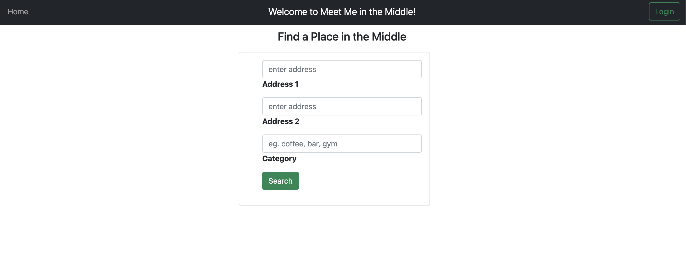
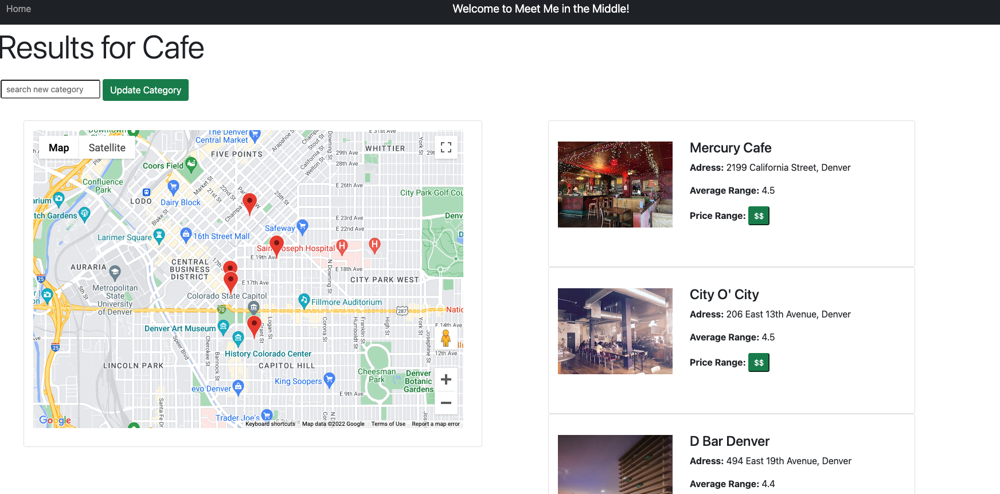

# Meet Me in the Middle Front End Repo


## Table of Contents
- [App](#app)
- [Background](#background)
- [Requirements](#requirements)
- [Contributors](#contributors)

### App

Meet Me in the Middle app can be found on [heroku](https://mmim.herokuapp.com/).


### Background

Have you ever wanted to meet up with friend but did not know where to go? This app lets a user enter two addresses and then search for a location in the middle of those two addresses. The user can also chose to search for a specific category of results.



Using Google API the user is then sent to a page where they can see their results. A map is displayed on the page with pinpoints indicating the results. Then the user sees a list of results with an image, address, average rating, and a price range.




### Requirements
Note: You must also install and run [mmie_be](https://github.com/MMIM-Turing/mmim_be.git) for full functionality.

#### API
- Go to [Google](https://developers.google.com) and follow instructions for Google Developer setup and to create an API key.
- Create a [Google Geocode API](https://developers.google.com/maps/documentation/geocoding/start).
- Create a [Google Places API](https://developers.google.com/maps/documentation/places/web-service/overview).

#### Setup
1. Clone this repository: On your local machine, open a terminal session and enter the following commands for SSH or HTTPS to clone the repo.

- using SSH key <br>
```shell
$ git clone git@github.com:MMIM-Turing/mmim_fe.git
```

- using HTTPS <br>
```shell
$ git clone https://github.com/MMIM-Turing/mmim_fe.git
```

Once cloned, you'll have a new local copy in the directory you ran the clone command in.

2. Change to the project directory: In terminal, use `$cd` to navigate to the project directory.

```shell
$ cd mmim_fe
```

3. Install required Gems utilizing Bundler: <br>
In terminal, use Bundler to install any missing Gems. If Bundler is not installed, first run the following command.

```shell
$ gem install bundler
```

If Bundler is already installed or after it has been installed, run the following command.

```shell
$ bundle install
```

4. Database Migration<br>
Before using the web application you will need to setup your databases locally by running the following command

```shell
$ rails db:{drop,create,migrate,seed}
```


5. Startup and Access<br>
Finally, in order to use the web app you will have to start the server locally and access the app through a web browser.
- Start server

```shell
$ rails s
```

- Open web browser and visit link
    http://localhost:5000 <br><br>

### Contributors

|  | |
| --- | --- |
| Joseph Downs | [GitHub](https://github.com/josephdowns) &#124; [LinkedIn](https://www.linkedin.com/in/josdowns/) |
| Kim Guo | [GitHub](https://github.com/kg-byte) &#124; [LinkedIn](https://www.linkedin.com/in/kim-guo-5331b4158/) |
| John Hennerich |[GitHub](https://github.com/jhennerich) &#124; [LinkedIn](https://www.linkedin.com/in/john-hennerich/) |
| Will Medders | [GitHub](https://github.com/wmedders21) &#124; [LinkedIn](https://www.linkedin.com/in/will-medders-781a80232/) |
| Oscar Santos | [GitHub](https://github.com/Oscar-Santos) &#124; [LinkedIn](https://www.linkedin.com/in/oscar-santos-perez/) |
|Max Wagner | [GitHub](https://github.com/MWagner3) &#124; [LinkedIn](https://www.linkedin.com/in/maximilian-wagner3350/)|
